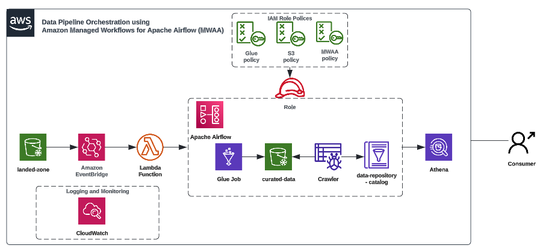

# Laboratorio Olympics Data Analytics Azure

Este laboratorio se basa en el [artículo](https://medium.com/contino-engineering/data-pipeline-orchestration-using-amazon-managed-workflows-for-apache-airflow-mwaa-60e5b213a0a7) **Data Pipeline Orchestration - Using Amazon Managed Workflows for Apache Airflow (MWAA)**, realizado por Naseer Ahmad a través de la plataforma Medium.

## Tecnologías

En este laboratorio se utilizan algunos servicios de **AWS** que cumplen funciones de almacenamiento y transformación de datos, como también orquestación de pipelines.

Servicios:

- Amazon Managed Workflows for Apache Airflow (MWAA)
- Amazon Simple Storage Service (S3)
- AWS CloudFormation
- AWS Lambda
- AWS Glue
- Amazon Athena
- Amazon CloudWatch
- Amazon EventBridge
- AWS Identity and Access Management (IAM)

## Arquitectura

